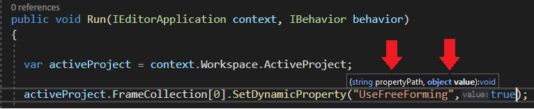

# zenon Dynamic Properties Extensions
This project provides extension methods for setting Dynamic Properties in zenon AddIns. 

Searching for the right dynamic property string and guessing the correct parameter type (which is often object) can be an exhausting task. The extensions make your life easier!

## Example
In the following example, the setting ```Freely defineable frame shape``` is set for the first frame. 

The conventional way for setting the dynamic property is to get the string value or the property path from the embedded help in the zenon Editor/Engineering Studio or the xml export of the frame.

The tooltip of the ```SetDynamicProperty``` Method indicates that the ```value``` parameter is of type ```object```. As this is somewhat undefined a programmer implementing this method _would have to guess_ that the value is a boolean as the property is linked to a checkbox.



Using the extension methods for the type ```IFrame```, the method name links to the dynamic property path. Also the type does not need to be guessed as is given in the tooltip of the extension method.


## Installation
Add the ```zenonExtensions``` project to your solution.
Add it as reference to the project where you want it to use.


## Limitations
The extensions are create automatically from an xml file. The xml file is generated from various sources. Some of them are the documentation, the .odl file or the zenon source code. The extensions are created for the zenon version 8.20 but can most probably also be used in other zenon versions.

The name of the extension methods is derived from the dynamic property path. It is possible, that the name or label in zenon Editor / Engineering studio is somewhat different.

Because the structure of the zenon dynamic properties is very heterogenous it could be that some of the extension methods are not working. You can report this non-working extension methods and I'll fit the generator to correct the extension method.

Other extension methods include functionality which is already present in the current AddIn framework. In this case do not use the extension method but rather the existing property or method.